# Portafolio de Evidencias: Sistema de Recomendación Basado en Contenido

Este documento detalla el paso a paso del desarrollo de un sistema de recomendación utilizando Inteligencia Artificial (GitHub Copilot), procesamiento de lenguaje natural (TF-IDF) y control de versiones con Git y GitHub.

---

## Fase 1: Creación del Repositorio en la Nube
El proyecto comenzó con la creación del repositorio público `AI_Project_yp` en la plataforma web de GitHub, inicializándolo con un archivo README base para establecer la conexión remota.
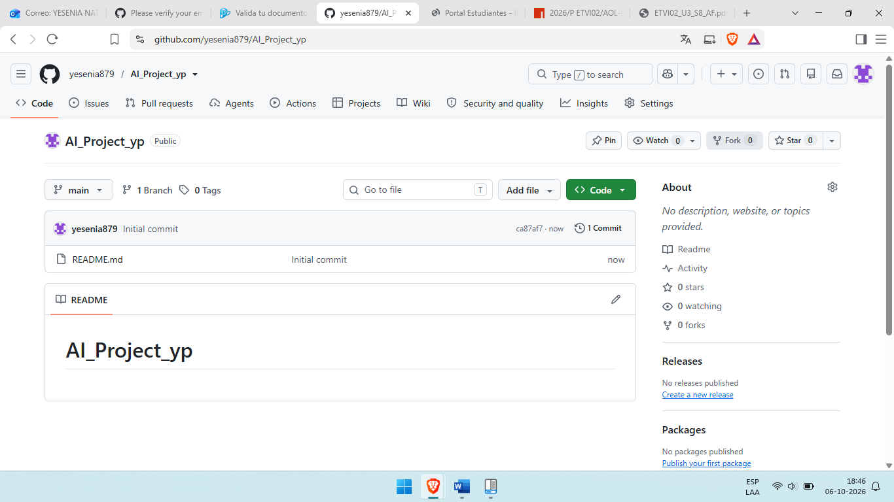

## Fase 2: Clonación y Configuración del Entorno Local
Al intentar descargar el repositorio al entorno local, ocurrió un error de sintaxis en PowerShell (`CommandNotFoundException`) debido a la ejecución incorrecta del comando `git clone` concatenado directamente con la ruta.
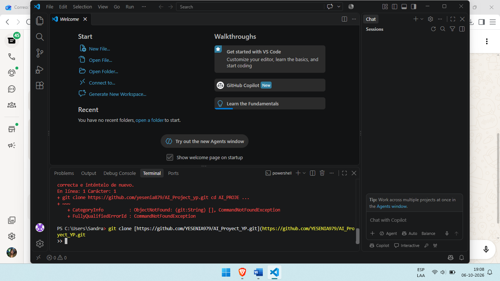

Tras corregir el comando, el repositorio se descargó de forma exitosa en el equipo.
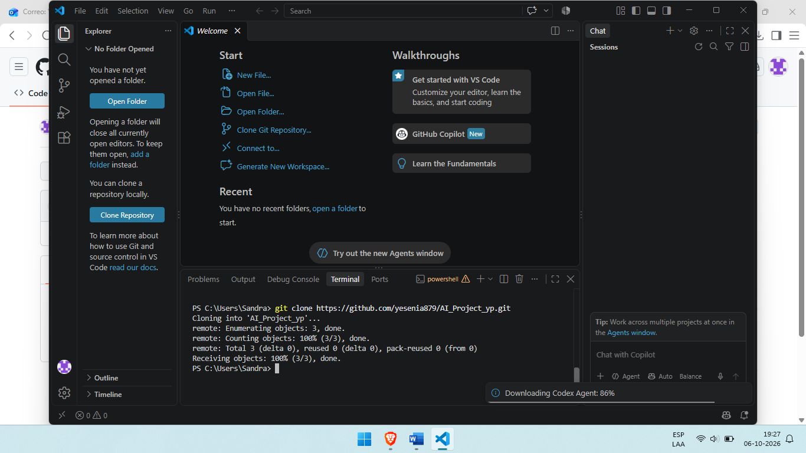

Una vez clonado, se pudo visualizar correctamente la carpeta del proyecto en el explorador de archivos de Visual Studio Code.
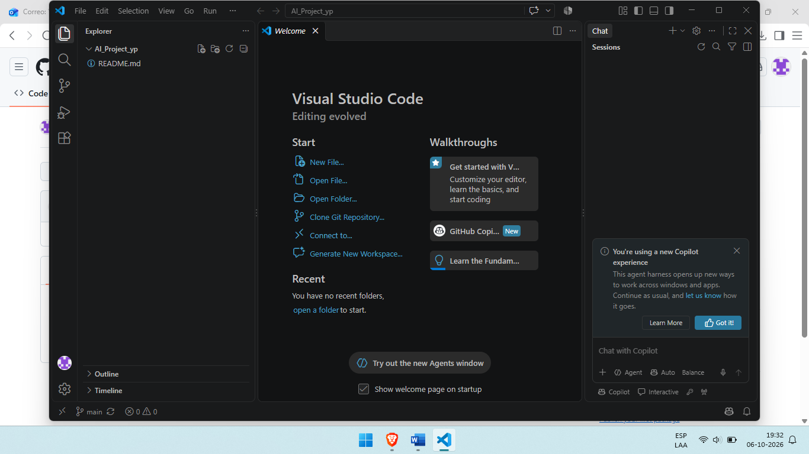

## Fase 3: Preparación de Herramientas y Archivos
Para programar correctamente, el editor sugirió e instaló la extensión de Python.

Se creó el archivo `recommendation_system.py` y se activó la asistencia de código. *(Nota: Las siguientes dos capturas muestran el mismo paso; la primera exhibe una advertencia emergente del sistema que luego fue descartada).*
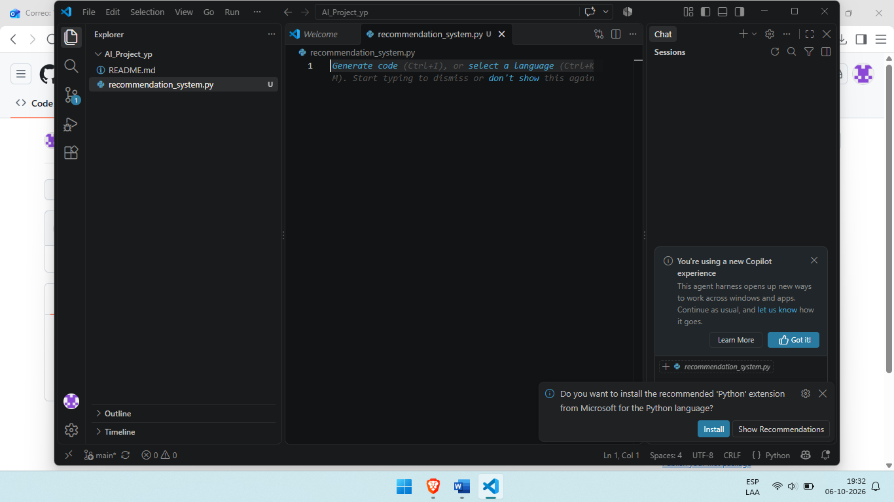
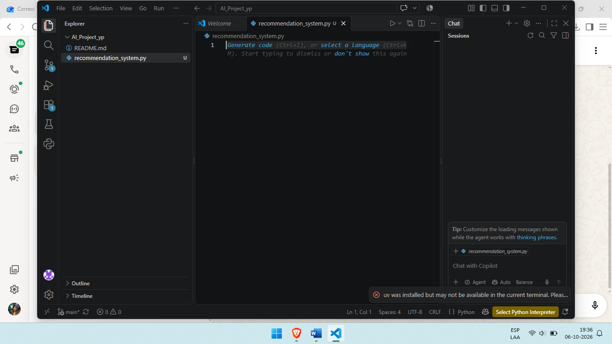

## Fase 4: Desarrollo de la Lógica con Inteligencia Artificial
Se utilizaron comentarios estructurados (*prompts*) paso a paso para guiar a GitHub Copilot en la lógica deseada.
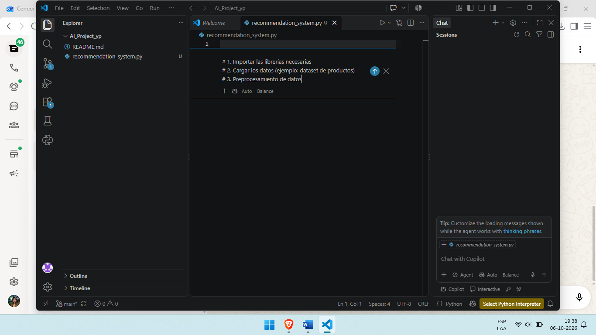

El sistema generó exitosamente el código utilizando `pandas` y `TfidfVectorizer` para procesar y vectorizar las descripciones de los productos. *(Nota: Ambas capturas muestran el código resultante finalizado durante su proceso de revisión).*

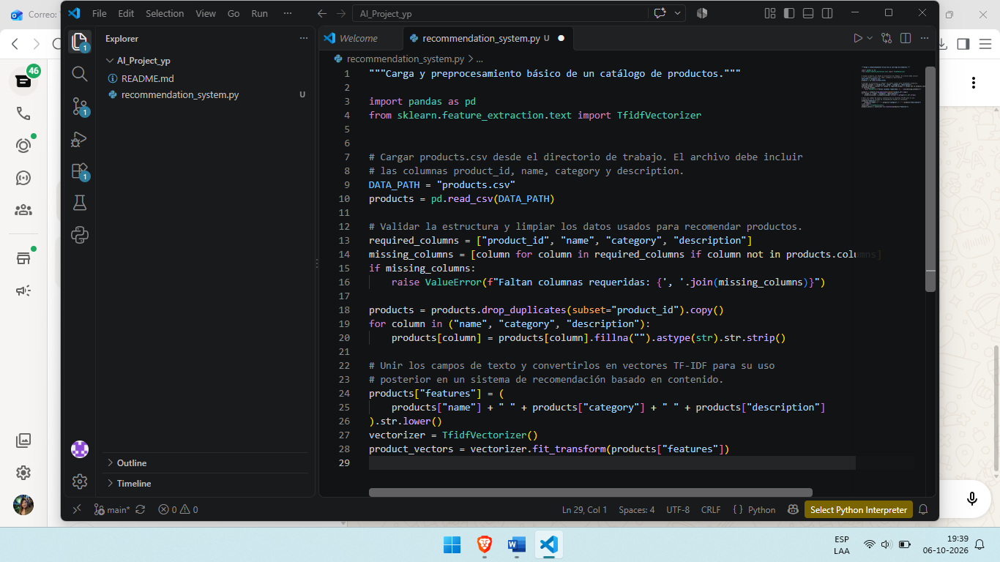

## Fase 5: Control de Versiones Local (Add y Commit)
Una vez validado el script, se prepararon los archivos modificados en el área de ensayo con `git add .`.
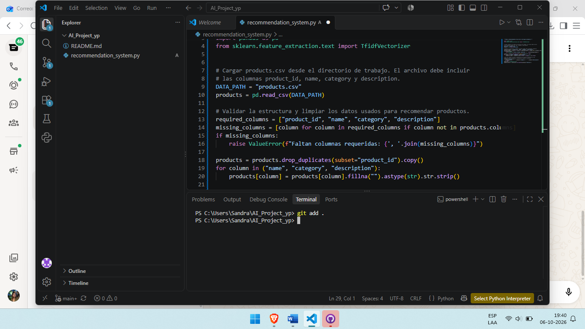

Posteriormente, se empaquetó el avance localmente con un mensaje descriptivo usando `git commit`.
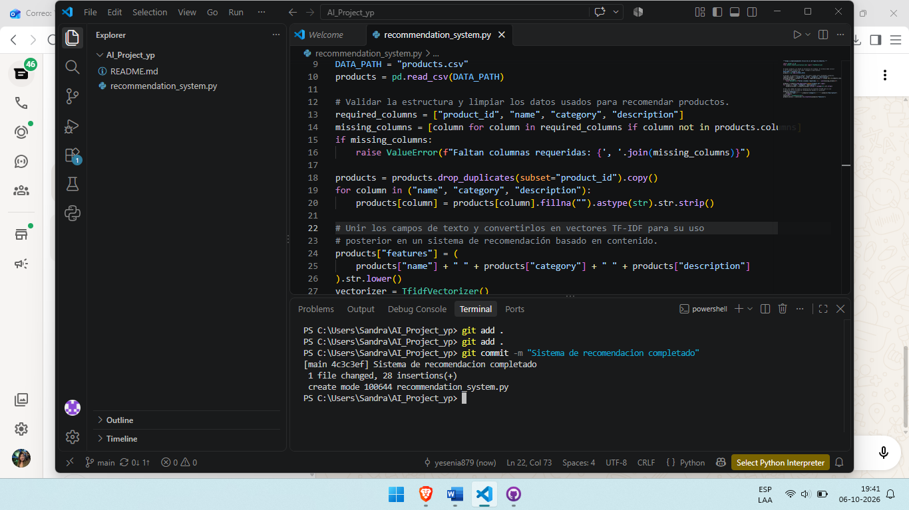

## Fase 6: Autenticación de Seguridad con GitHub
Para subir los cambios a la nube por primera vez en esta sesión, las políticas de seguridad requirieron validación de dispositivo, emitiendo un código en Visual Studio Code.
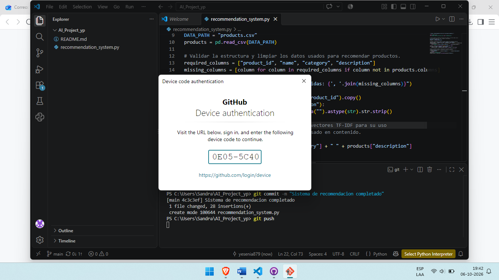

Dicho código se ingresó manualmente en el navegador web para autorizar la conexión entre el equipo de la usuaria y GitHub.
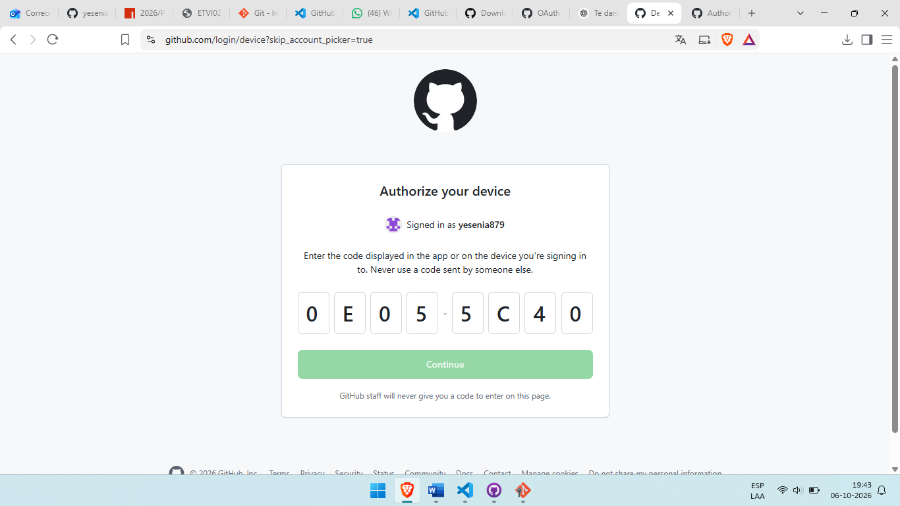

## Fase 7: Despliegue Final (Git Push)
Completada la autenticación, la terminal ejecutó exitosamente el `git push`, subiendo el 100% de los datos a la rama principal y completando la entrega del proyecto.
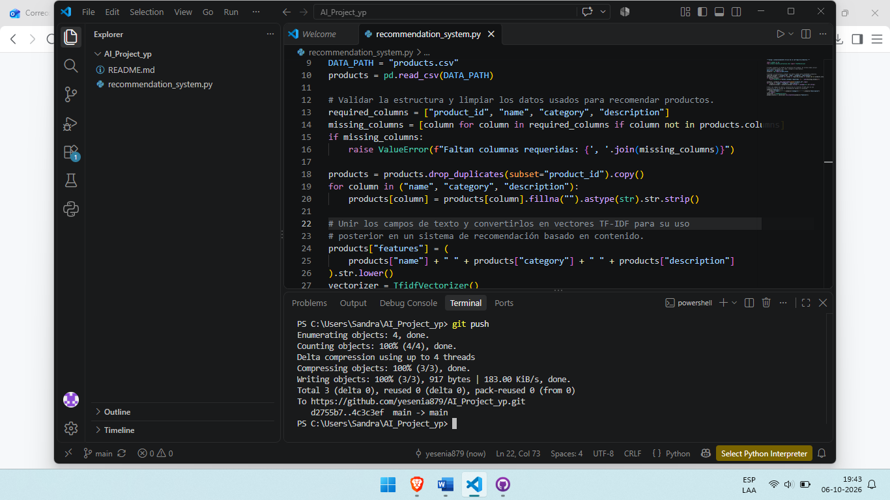